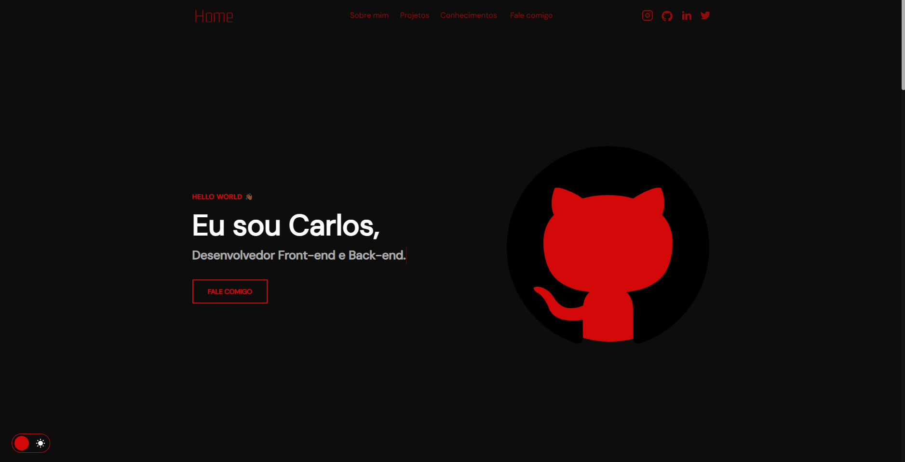

<h1 align="center">Currículo/Portfólio interativo - Carlos Bearzotti</h1>

<h4 align="center"><a href="https://curriculo-lemon-mu.vercel.app">Veja o Projeto</a></h4>

---

## 💻 Sobre

Projeto feito no intuito de refinar meus conhecimentos em Front-End e exibir meus projetos e habilidades técnicas.

O site continua recebendo atualizações de projetos e currículo conforme minha evolução como desenvolvedor Full Stack & Blockchain.

## 🧠 Tecnologias utilizadas no site:

    
    
    

## 🚀 Projetos exibidos

| Projeto | Tecnologias |
|---------|-------------|
| [Curriculo](https://github.com/carlosbearzotti/Curriculo) | HTML, CSS, JS |
| [Blockchain](https://github.com/carlosbearzotti/blockchain) | Solidity, TypeScript, Python, JS |
| [nu26](https://github.com/carlosbearzotti/nu26) | Python, Jupyter Notebook |
| [Algorithmes](https://github.com/carlosbearzotti/Algorithmes) | Python, Java, PHP, C, C# |
| [pi-letters](https://github.com/carlosbearzotti/pi-letters) | Python, Pandas, Scikit-learn |
| [Stigler's Diet Problem](https://github.com/carlosbearzotti/atc-stigler_diet_problem) | Python, Jupyter Notebook |

## 🛠️ Stack completa

**Linguagens:** Go, TypeScript, JavaScript, Python, Java, PHP, C#, Solidity, C  
**Front-end:** React, HTML, CSS  
**Back-end:** Node.js, Go, PHP  
**Blockchain:** Solidity, Web3  
**Dados:** MySQL, PostgreSQL, MongoDB, SQLite  
**DevOps:** Docker, Git  
**ML/Data Science:** Pandas, NumPy, Scikit-learn, TensorFlow

---

<table>
  <tr>
    <td>
      
    <td>
      Feito por <a href="https://github.com/carlosbearzotti">Carlos Eduardo Bearzotti da Silva.</a>
    </td>
  </tr>
</table>
